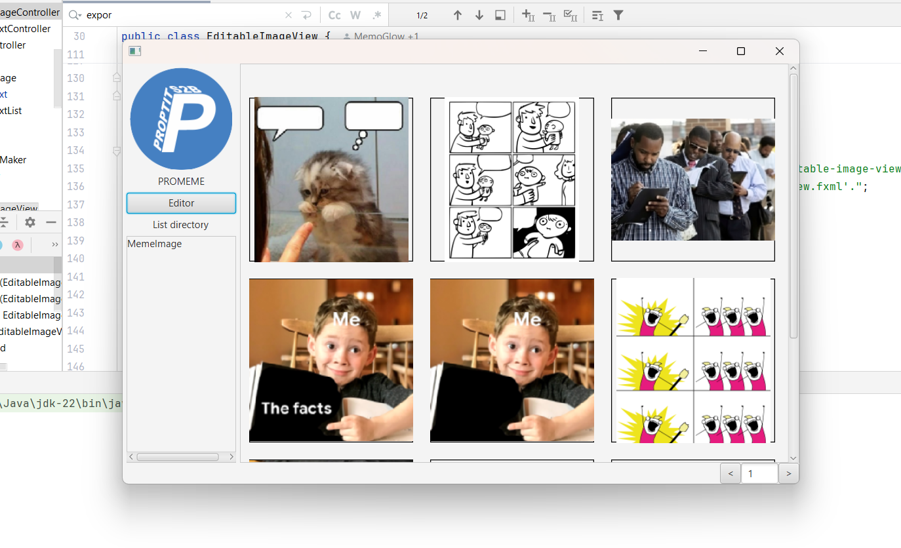
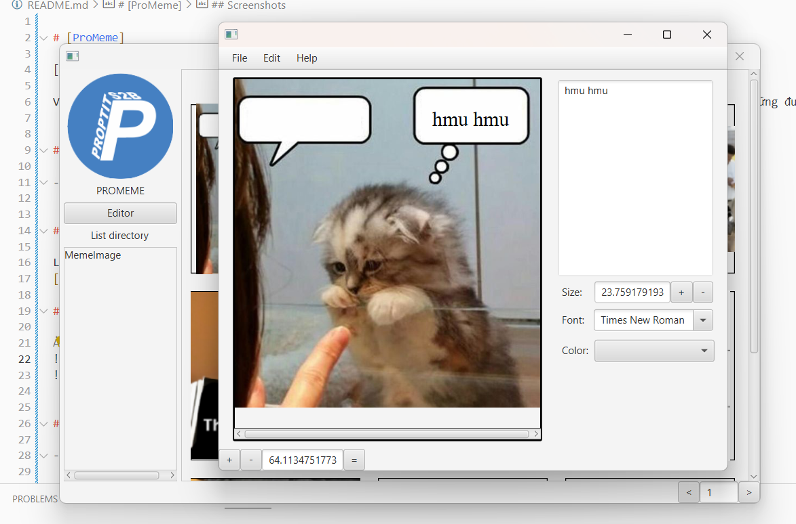

# [ProMeme]

[Mô tả dự án]

Ví dụ: Cùng với nhu cầu edit ảnh meme ngày càng tăng cao. Ứng dụng ProMeme với khả năng thêm chữ có thể đáp ứng được các nhu cầu.


## Authors

- [MemoGlow](https://github.com/MemoGlow)


## Demo

Link Video Demo: 
[Video demo](https://youtu.be/XRO-fxSkVPM)

## Screenshots

Ảnh




## Features

- Các chức năng chính của ứng dụng
    - Thư viện ảnh meme.
    - Xem ảnh, thu phóng ảnh.
    - Thêm chữ vào ảnh, có thể thay đổi font chữ, cỡ chữ, màu chữ, thay đổi vị trí của chữ.
    - Lưu ảnh đang sửa thành file project để sau đó có thể tiếp tục chỉnh sửa.
    - Xuất ảnh đã chỉnh sửa.

## Diagram
[Class Diagram](https://drive.google.com/file/d/1I_jBk8BfsvvF-7BDT_Bp3yJ7JbHzVEn3/view?usp=sharing)

## Requirements

- Java 22.
- Maven
- Javafx 22.

## Installation

Cách cài đặt dự án

```bash
  - Clone dự án
  - Mở terminal và chạy lệnh: mvn clean install
  - Chạy ứng dụng

  - Down file jar từ ...
  - Chạy file jar
```
    

## License

[MIT](https://choosealicense.com/licenses/mit/)